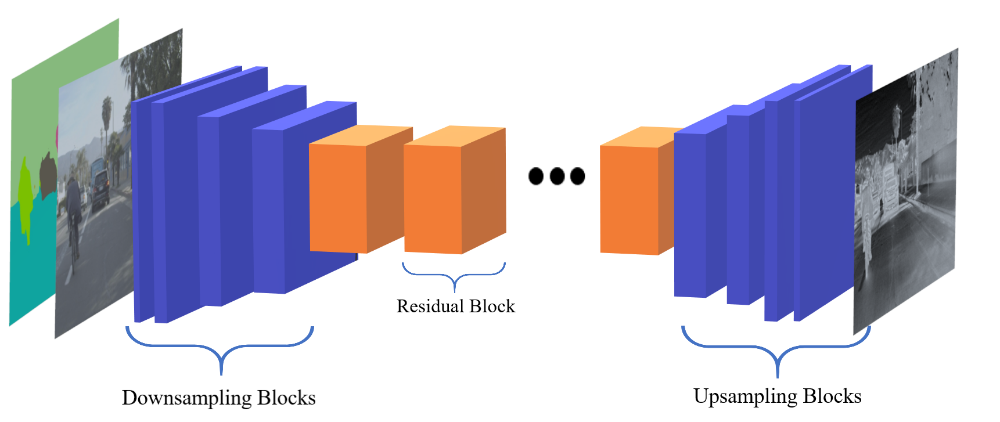
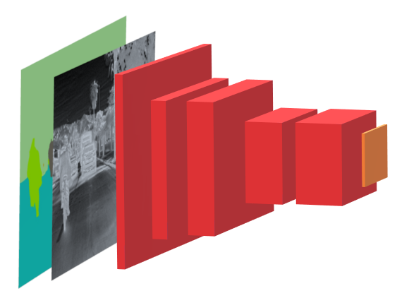
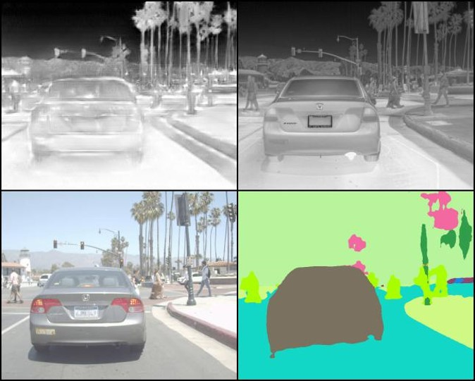
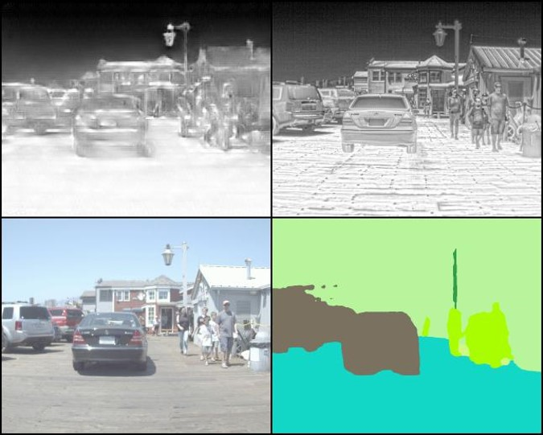

# The Project

This project aims to create partially novel generative adversarial network model that can translate RGB image to the IR image

## Motivation

IR imaging is used in many crucial applications such as, surveillance, UAVs, search and rescue operations etcetera. To improve their abilities, most of these systems work with deep learning algorithms. And, due to the nature of deep learning, they need a huge amount of data for training. However, IR images are hard to obtain due to the high cost of IR cameras. And even with a camera, obtaining images for specific scenarios could be very time-consuming. So, I want to create a model that can translate RGB image to IR image with high quality.

According to Stefan-Boltzmann Law, Every object above the temperature of absolute zero degree emits electromagnetic radiation due to its internal energy. And, the amount of this radiated energy is proportional to the emissivity of the material and also proportional to the fourth power of its absolute temperature. This thermal radiation can be detected partially through infrared cameras. Especially objects at room temperature almost only emits infrared light.
As a result, we can conclude that material type gives important information about the amount of radiation since emissivity directly, and temperature of an object indirectly depends on the material type. Thus, if the model can learn the material types, it can also translate them to the IR image. To this end, to improve the result, I also obtained the semantic segmented version of the dataset by the means of PSPNET pretrained on cityscapes dataset which is a similar to FLIR thermal dataset in terms of objects they contain.

## The Dataset

I used [FLIR Thermal Dataset](https://www.flir.com/oem/adas/adas-dataset-form/). I resized the dataset to have same size 640x512.

To improve the result further, I used semantic segmantation of the input image, and concatanate it to the input. For this purpose, I used keras-segmentation module which let us to use pretrained segmentation network.

## The Generator Model

As a generator network, a modified version of the image stylization network proposed by Johnson et al. was preferred. This was also the part of Pix2PixHD model. However, to avoid checkboard effects early in the training, the direct convolutional layer was preferred instead of the transposed convolution. Also, the number of residual blocks was decreased considering the resolution of the dataset. Each block in the following figuure contains a convolution layer, leaky rectified linear activation function, and instance normalization.

Above figure illustrates the generator network. Downsampling and upsampling blocks are represented with the blue blocks. Between these, there are 6 residual blocks to refine the feature maps over and over again.

## The Multi-Scale Discriminator Model

I designed generic classification network except that it yields a matrix of values, so it works like a PatchGAN.  

To implement a multi-scale discriminator, 2 different discriminators are used. The first one processes the original images, and the second one processes the images that are resized by the ratio of 1/2.
Notice that instead of just one prediction value, the discriminator outputs a prediction matrix which was shown as an orange block in above figure. Each value in the matrix focuses on the 80 by 80 pixel in the input image i.e. effective receptive field is 80.

## The Loss Function

To optimize the parameters of generator and discriminator, the least-square loss was preferred. To improve its performances, additionally, feature matching loss and perceptual loss were used. As a result, the overall loss function turned out to be following form for the generator:

And for the multi-scale discriminator:

## Training Details

I trained the model for a 100 epochs with and without segmented input. I used Adam optimizer with learning rate of 0.0002 and 0.00004 for generator and discriminator respectively. Due to the limited resources, I resized the input image with a factor of 2.

For training, Google Colab Pro Notebook environment was prefered.

## Result

Top left: generated IR
Top right: ground truth
Bottom left: rgb image
Bottom right: semantic segmented version of rgb image.

1st row: predicted IR, Ground truth IR, and 2nd row: RGB, segmented RGB.

...resimler...

As can be seen, two types of distortion in the images can be noticed — ghosting and a kind of fixed-pattern noise. Also, the image segmentation network did not work perfectly, so it affected the performance of the model.

To improve the results, there are many hyper-parameters to tune. Also, loss function can be changed to Wasserstein loss or another loss in the literature. 

Additionally, it was observed that loss of the generator dropped imidiately since Adam has adaptive learning rate ability, controlling the learning rate did not result in as expected, so other optimization functions could be used.

Another issue is to understand the importance of each component of the loss function by doing an ablation study. For instance, the results of the two models trained with and without the perceptual loss can be compared.

Lastly, the dataset at the hand was not very comprehensive. Training with different datasets may improve the results.

